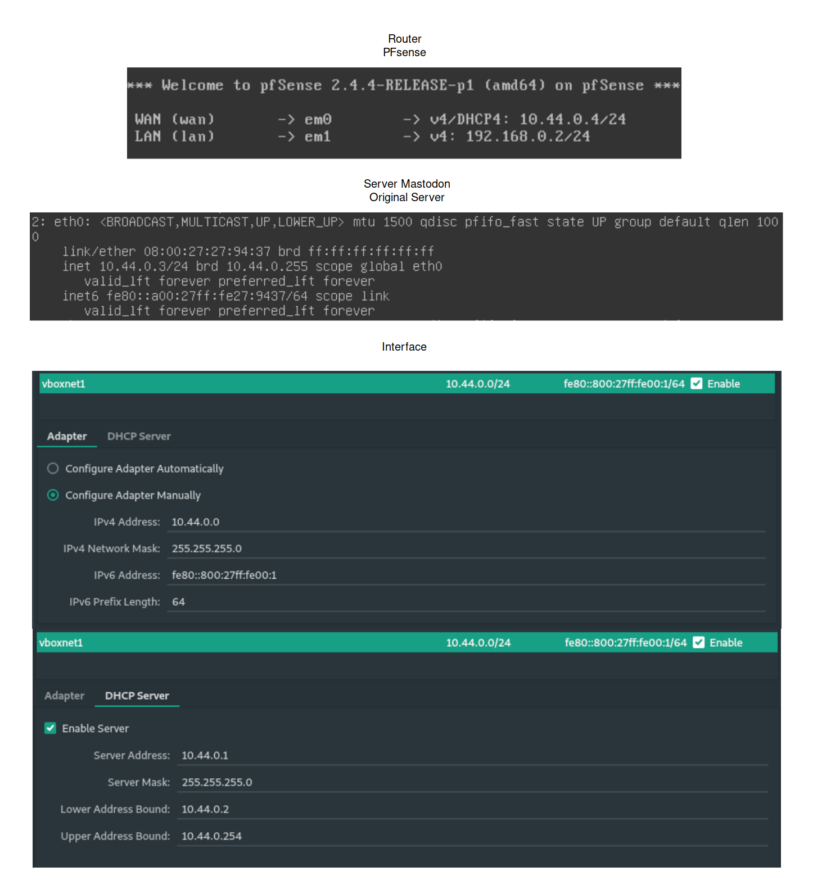
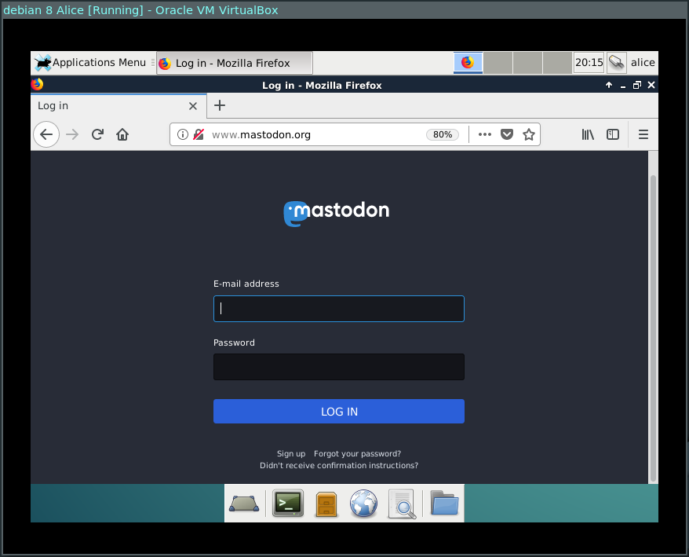
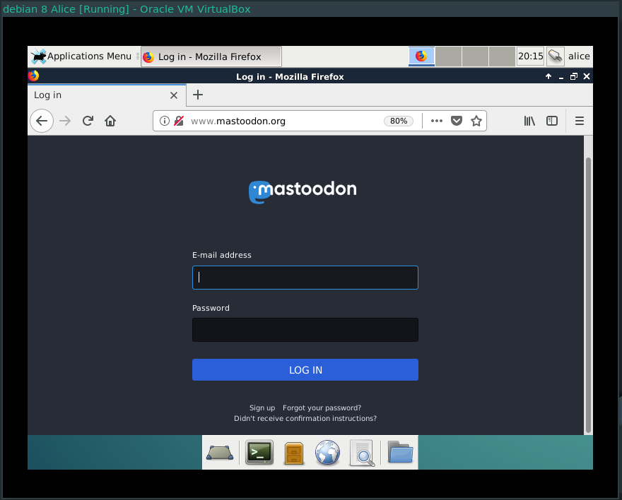
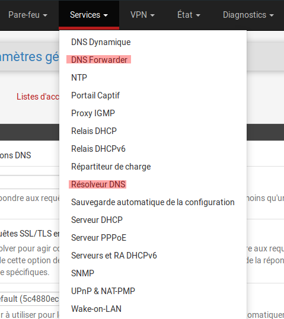
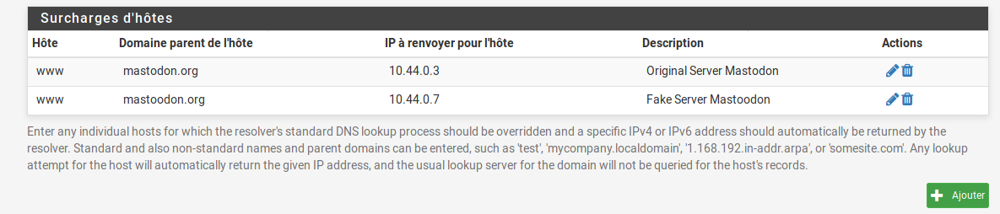
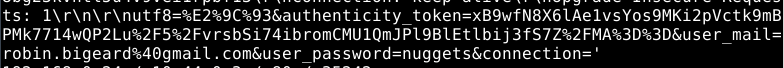

# Man-in-the-Middle 
<br>

Groupe: 
* Robin Bigeard
* Samy Vera
* Matteo Lecuit

<br>

## Réseau




<br><br><br>

------
## Installation d'un serveur Apache 2 / PHP / PhpMyAdmin
------

```
$ apt-get update
$ apt-get upgrade
```

```
$ apt-get install apache2
$ systemctl reload apache2
```
Tester le server: http://10.44.0.3/ ou http://localhost

```
$ apt-get install php5
$ apt-get install mysql-server
$ apt-get install php5-mysql
```

```
$ apt-get install phpmyadmin

$ cd /var/www/html/example.org/public_html
$ sudo ln -s /usr/share/phpmyadmin

$ systemctl reload apache2
```
Tester le server: http://10.44.0.3/phpmyadmin ou http://localhost/phpmyadmin


`$ cd /var/www/html/`  - Ceci est le lien pour déposer le fichier visible sur le réseau.

```
$ chmod 644 -R /var/www/html/
$ rm /var/www/html/index.html
```

On utilise Filezilla pour le transfert les fichiers d'un ordinateur à un serveur.
https://filezilla-project.org/

On utilisera du SFTP pour la connexion du coup, il faudra activer le SSH sur le serveur.

<br><br><br>

------
## Présentation des serveurs Original / Fake
------

Le serveur original est basique. Il y a une page de connexion et une page qui indique que la connexion est réussie.

Et pour le serveur fake on a une page de connexion qui ressemble de très près a la page de connexion de du serveur original sauf que a la place de s'appeler matodon on la appeler mastoodon avec deux "o". On remarque la différence grâce au logo et au nom de domaine.

Une fois que l'utilisateur se connecte sur le serveur fake, l'e-mail et le mot de passe sont enregistrer dans une base de donner. En suite, l'utilisateur est redirigé sur le vrai site avec un message d'erreur.

Dans la meilleure optique le serveur fake devrais vérifier en même temps si l'e-mail et le mot de passe sont correcte sur le serveur original pour valider la connexion et envoyer un cookie à l'utilisateur cible pour éviter tous soupçon.

[Serveur Original (Mastodon)](https://github.com/Bigeard/Man-in-the-Middle/tree/master/server-original-mastodon)   



[Serveur Fake (Mastoodon)](https://github.com/Bigeard/Man-in-the-Middle/tree/master/server-fake-mastoodon)  


<br><br><br>

------
## Installation de Python 3.7 / Pip3 / Scapy / PyQt5
------

### Installation de Python 3.7
```
$ sudo nano /etc/apt/sources.list
# Ajouter la ligne dans le fichier
deb http://ftp.de.debian.org/debian testing main
$ echo 'APT::Default-Release "stable";' | sudo tee -a /etc/apt/apt.conf.d/00local
$ sudo apt-get update
$ sudo apt-get -t testing install python3.6
$ python3 -V
=> python 3.7
```
### Installation de Pip3
```
sudo apt-get -t testing install python3-pip
```
### Installation de Scapy
```
pip3 install scapy
```
### Installation de PyQt5
```
pip3 install pyqt5
```

<br><br><br>

------
## Configuration des DNS
------

Il faut aller dans DNS Forwarder et Résolver DNS pour configurer le DNS en local.
  
Pour ça, il faut ajouter des surcharges d'hôtes et entrer les informations suivantes  


<br><br><br>

------
## Conclusion
### Comment éviter une attaque man in the middle ?
------
ARP Spoofing  
HTTP packet manipulation

- Il faut éviter de se connecter sur un réseau public si possible.

- Il ne faut pas se connecter sur un site qui ne possède pas de certificat SSL. Car grâce à un sniffer, un haker peu voir l'identifiant et le mot de passe en claire ( identifiant: robin.bigeard@gmail.com / mot de passe: nuggets ).




- Il faut faire très attention au nom de domaine ou vous vous connectez, car il y a des possibilité que le site soit un site web fake.

- Si possible, il faut utiliser un gestionnaire de mot de passe comme Keepassxc.

    Un gestionnaire de mot de passe permet de garder en mémoire des mots de passe dans une base de données cryptées. Il a pour but d'éviter les utilisateurs de mettre de mot de passe trop cohérent qui pourrait être référencé dans un dictionnaire de mot de passe.

    Mais le gestionnaire de mot de passe à une autre utiliser. Si on installe le module pour son navigateur le gestionnaire mot de passe à la possibilité de vérifier si le nom de domaine et le certificat SSL sont correcte et si ce n'est pas le cas de prévenir l'utilisateur.


    Keepassxc est un gestionnaire de mot de passe gratuit et open source.